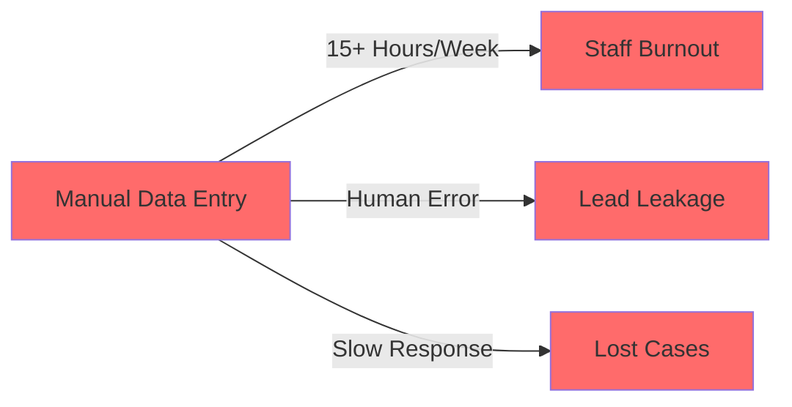

# 🎯 AI Plaintiff Intake

<div align="center">


### 🚀 Premium AI-Powered Intake Automation for Plaintiff Law Firms

*Transform your client intake process with custom-tailored automation that works with any form platform and integrates seamlessly with Clio CRM*

[🎥 Watch Demo](#-demo) • [📖 Documentation](#-documentation) • [🌟 Features](#-key-features) • [🚀 Quick Start](#-quick-start)

</div>

---

## 📊 Overview

**AI Plaintiff Intake** is a premium, custom-built automation platform designed specifically for small to medium-sized plaintiff law firms. Unlike generic SaaS solutions, this platform is **tailor-made** for your unique workflow, integrating with your existing forms (Tally, Typeform, Google Forms, or custom solutions) and automatically syncing leads to Clio CRM with zero manual data entry.

### 💡 The Problem We Solve



### ✅ The Solution


---

## 🎥 Demo

<div align="center">

### See It In Action

[](https://www.youtube.com/watch?v=ijISXWsyFyw)

*Click to watch how AI Plaintiff Intake transforms your client intake process*

</div>

---

## 🌟 Key Features

<table>
<tr>
<td width="50%">

### 🔌 Universal Integration
- ✅ Works with **any form platform**
- ✅ Direct **Clio CRM** sync
- ✅ Custom field mapping
- ✅ No code changes required

</td>
<td width="50%">

### 🤖 AI-Powered Processing
- ✅ Lead scoring & qualification
- ✅ Automatic data extraction
- ✅ Smart notifications
- ✅ Error-free migration

</td>
</tr>
<tr>
<td width="50%">

### ⚡ Zero Lead Leakage
- ✅ 100% capture rate
- ✅ Instant webhook processing
- ✅ Automated follow-ups
- ✅ Real-time monitoring

</td>
<td width="50%">

### 🎯 Custom-Tailored
- ✅ Built for **your** workflow
- ✅ Premium support included
- ✅ Dedicated integration team
- ✅ Risk-free consultation

</td>
</tr>
</table>

---

## 📈 Impact Metrics

<div align="center">

### Real Results for Plaintiff Firms

| Metric | Before | After | Improvement |
|--------|--------|-------|-------------|
| ⏱️ **Time on Data Entry** | 20 hrs/week | 0 hrs/week |  |
| 📉 **Lead Leakage** | 8-12% | 0% |  |
| ⚡ **Response Time** | 2-4 hours | 5 minutes |  |
| 💰 **Cost Savings** | $0 | $2,400/mo |  |

</div>

---

## 🛠️ Technology Stack

<div align="center">

### Built with Modern, Reliable Technologies

</div>

```mermaid
graph TB
    subgraph Frontend
        A[React 18.3] --> B[Vite 5.4]
        B --> C[Tailwind CSS 3.4]
        C --> D[Framer Motion 11.5]
    end
    
    subgraph Backend Integration
        E[n8n Webhook] --> F[Custom API]
        F --> G[Clio API]
    end
    
    subgraph Features
        H[SEO Optimized]
        I[Responsive Design]
        J[Analytics Tracking]
    end
    
    Frontend --> Backend Integration
    Frontend --> Features
    
    style Frontend fill:#10b981
    style Backend Integration fill:#3b82f6
    style Features fill:#8b5cf6
```

### Core Technologies

| Technology | Version | Purpose |
|------------|---------|---------|
| ⚛️ React | 18.3 | UI Framework |
| ⚡ Vite | 5.4 | Build Tool & Dev Server |
| 🎨 Tailwind CSS | 3.4 | Styling Framework |
| 🎭 Framer Motion | 11.5 | Animations |
| 🧭 React Router | 6.26 | Navigation |
| 🔍 React Helmet | 2.0 | SEO Optimization |
| 🎯 Lucide React | 0.445 | Icon System |

---

## 🚀 Quick Start

### Prerequisites

```bash
Node.js >= 18.0.0
npm >= 9.0.0
```

### Installation

```bash
# Clone the repository
git clone https://github.com/systemifyautomation/tally-clio-lead-automation.git

# Navigate to project directory
cd tally-clio-lead-automation

# Install dependencies
npm install

# Start development server
npm run dev

# Build for production
npm run build

# Preview production build
npm run preview
```

### 🌐 Development URLs

- **Local**: `http://localhost:5173`
- **Network**: Access from any device on your network

---

## 📖 Documentation

### Project Structure

```
tally-clio-lead-automation/
├── 📁 src/
│   ├── 📁 assets/           # Images, logos, fonts
│   │   ├── logo.svg
│   │   └── logo.png
│   ├── 📁 components/       # Reusable components
│   │   ├── ConsultationModal.jsx
│   │   ├── Navbar.jsx
│   │   ├── Footer.jsx
│   │   └── ScrollToTop.jsx
│   ├── 📁 pages/           # Route pages
│   │   ├── HomePage.jsx
│   │   ├── ProductPage.jsx
│   │   ├── DocumentationPage.jsx
│   │   ├── SupportPage.jsx
│   │   └── PrivacyPolicyPage.jsx
│   ├── 📁 config/          # Configuration files
│   │   ├── siteConfig.js
│   │   └── qualifyingQuestions.js
│   ├── App.jsx             # Route configuration
│   ├── main.jsx           # App entry point
│   └── index.css          # Global styles
├── 📁 public/             # Static assets
├── index.html             # HTML template
├── vite.config.js        # Vite configuration
├── tailwind.config.js    # Tailwind configuration
├── postcss.config.js     # PostCSS configuration
└── package.json          # Dependencies
```

### Key Components

#### 🎯 ConsultationModal
Interactive multi-step form with:
- Progressive question display
- Form validation
- Webhook integration to n8n
- Conversion source tracking
- Loading states & error handling

#### 🧭 Navbar
Responsive navigation with:
- Logo integration
- Support contact information
- Mobile hamburger menu
- CTA buttons with conversion tracking

#### 📝 Configuration Files

**`siteConfig.js`** - Central configuration for:
- Company information
- Contact details
- Social media links
- Booking URLs

**`qualifyingQuestions.js`** - Consultation form questions:
- 10 qualifying questions
- Multiple input types (text, email, tel, select, textarea)
- Customizable options

---

## 🎨 Design System

### Color Palette

```css
/* Primary Colors */
--primary-400: #34d399  /* Light Green */
--primary-500: #10b981  /* Primary Green */
--primary-600: #059669  /* Dark Green */

/* Background Colors */
--dark-bg: #0a0a0a      /* Main Background */
--dark-card: #111111    /* Card Background */
--dark-gradient: radial-gradient(ellipse at top, rgba(16, 185, 129, 0.08) 0%, rgba(10, 10, 10, 1) 50%)

/* Text Colors */
--text-white: #ffffff
--text-gray-300: #d1d5db
--text-gray-400: #9ca3af
```

### Typography

- **Font Family**: Inter (Google Fonts)
- **Headings**: Bold, 2xl-6xl
- **Body**: Regular, text-base to xl
- **Smoothing**: Antialiased

### Special Effects

- 🌟 **Glow Effects**: Green shadow animations
- 💎 **Glass Morphism**: Backdrop blur with transparency
- 🎭 **Hover States**: Scale & translate transforms
- ✨ **Animations**: Framer Motion page transitions

---

## 🔌 Integration Guide

### Webhook Configuration

The consultation form sends POST requests to:

```
https://n8n.systemify.net/webhook/new-lead-for-AI-plaintiff-intake
```

#### Payload Structure

```json
{
  "conversionSource": "hero-cta",
  "timestamp": "2025-12-06T10:30:00.000Z",
  "responses": [
    {
      "question": "What is your firm's name?",
      "answer": "Smith & Associates"
    },
    {
      "question": "What is your email address?",
      "answer": "john@smithlaw.com"
    }
    // ... 8 more questions
  ]
}
```

#### Conversion Sources

| Source | Location |
|--------|----------|
| `navbar-desktop` | Desktop navbar CTA |
| `navbar-mobile` | Mobile navbar CTA |
| `hero-cta` | Homepage hero button |
| `bottom-cta` | Homepage bottom CTA |
| `product-hero-cta` | Product page hero |
| `product-bottom-cta` | Product page bottom |
| `product-demo-cta` | Product demo button |

---

## 🎯 SEO Optimization

### Target Keywords

- ✅ AI plaintiff intake automation
- ✅ Clio CRM integration
- ✅ Legal form automation
- ✅ Personal injury lead management
- ✅ Law firm automation software
- ✅ Automated client intake
- ✅ Legal workflow automation
- ✅ Plaintiff firm technology

### Structured Data

All pages include Schema.org markup for:
- Organization information
- LocalBusiness
- LegalService
- ContactPoint

### Meta Tags

- Open Graph tags for social sharing
- Twitter Card integration
- Dynamic titles and descriptions per page

---

## 🚀 Deployment

### Build for Production

```bash
npm run build
```

Output directory: `dist/`

### Recommended Hosting

- ✅ **Vercel** - Zero configuration
- ✅ **Netlify** - Continuous deployment
- ✅ **AWS Amplify** - Enterprise scale
- ✅ **GitHub Pages** - Free static hosting

### Environment Variables

No environment variables required for basic operation. Add as needed for:

```bash
VITE_ANALYTICS_ID=your_analytics_id
VITE_API_URL=your_api_endpoint
```

---

## 📊 Analytics & Tracking

### Conversion Tracking

All CTA buttons include conversion source tracking:

```javascript
onClick={() => {
  setConversionSource('hero-cta')
  setShowConsultationModal(true)
}}
```

Track which buttons drive the most conversions to optimize your marketing.

### Recommended Analytics Tools

- 📈 Google Analytics 4
- 📊 Mixpanel
- 🎯 Hotjar
- 📞 CallRail (for phone tracking)

---

## 🛡️ Security & Compliance

### Data Protection

- ✅ HTTPS enforced
- ✅ No sensitive data stored client-side
- ✅ Webhook authentication available
- ✅ CORS configured properly

### Privacy Compliance

- ✅ GDPR compliant
- ✅ CCPA compliant
- ✅ Privacy Policy page included
- ✅ Cookie consent ready (add as needed)

---

## 🔧 Customization Guide

### Updating Company Information

Edit `src/config/siteConfig.js`:

```javascript
export const siteConfig = {
  companyName: "Your Firm Name",
  phone: "+1 (555) 123-4567",
  companyEmail: "contact@yourfirm.com",
  // ... more settings
}
```

### Adding New Questions

Edit `src/config/qualifyingQuestions.js`:

```javascript
{
  id: 'question_id',
  question: 'Your question text?',
  type: 'text', // text, email, tel, select, textarea
  placeholder: 'Enter your answer',
  required: true,
  options: [] // For select type only
}
```

### Styling Changes

Update `tailwind.config.js` for theme customization:

```javascript
theme: {
  extend: {
    colors: {
      primary: {
        400: '#your-color',
        500: '#your-color',
        600: '#your-color',
      }
    }
  }
}
```

---

## 📱 Browser Support

| Browser | Version | Status |
|---------|---------|--------|
| Chrome | Latest | ✅ Fully Supported |
| Firefox | Latest | ✅ Fully Supported |
| Safari | Latest | ✅ Fully Supported |
| Edge | Latest | ✅ Fully Supported |
| Mobile Safari | iOS 12+ | ✅ Fully Supported |
| Chrome Mobile | Android 8+ | ✅ Fully Supported |

---

## 🤝 Support & Contact

### Get Help

- 📧 **Email**: support@aiplaintiffintake.com
- 📞 **Phone**: +1 (251) 373-4661
- 📖 **Documentation**: [/documentation](#)
- 💬 **Support Portal**: [/support](#)

### Book a Consultation

Ready to transform your intake process? Book a free consultation:

🗓️ [Schedule Your Free Consultation](https://calendly.com/ai-plaintiff-intake/consultation)

---

## 📄 License

© 2024 AI Plaintiff Intake LLC. All rights reserved.

This is proprietary software. Unauthorized copying, distribution, or use is strictly prohibited.

---

## 🎯 Roadmap

### Q1 2025
- [ ] Mobile app for iOS & Android
- [ ] Advanced analytics dashboard
- [ ] Multi-language support

### Q2 2025
- [ ] AI-powered case value prediction
- [ ] Integration with additional CRMs
- [ ] Automated document generation

### Q3 2025
- [ ] White-label solution
- [ ] API for custom integrations
- [ ] Advanced reporting tools

---

<div align="center">

### Built with ❤️ for Plaintiff Law Firms

*Helping legal professionals focus on winning cases, not managing data*

[🌐 Visit Website](https://aiplaintiffintake.com) • [📧 Contact Us](mailto:contact@aiplaintiffintake.com) • [📞 Call Now](tel:+12513734661)

---

⭐ **Star this repo** if you found it helpful!

</div>